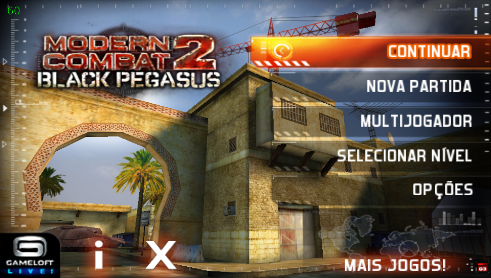
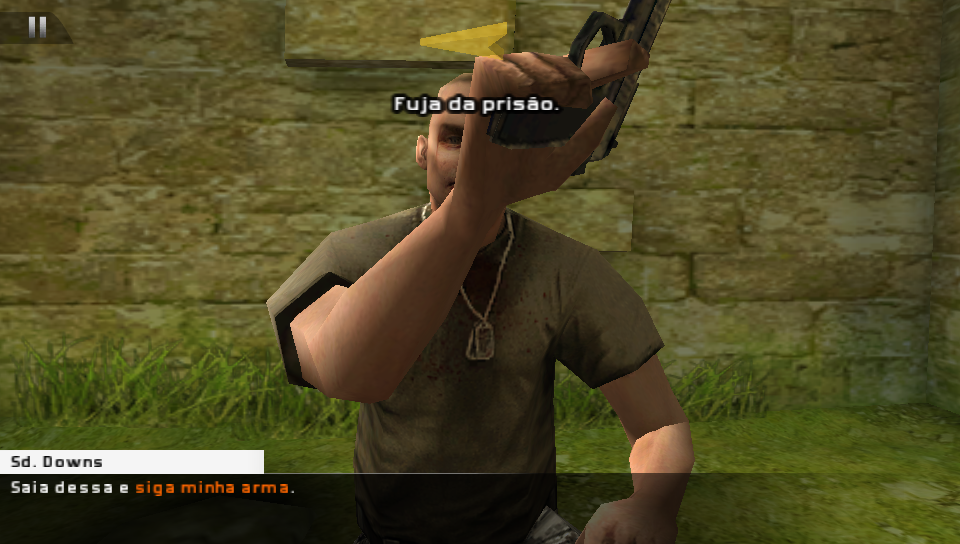
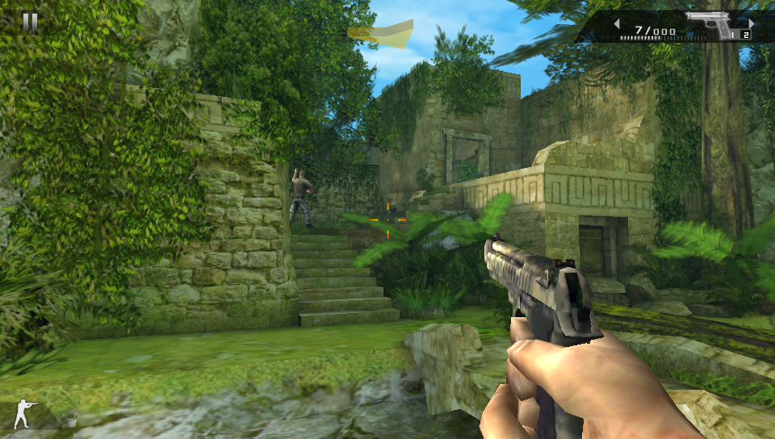
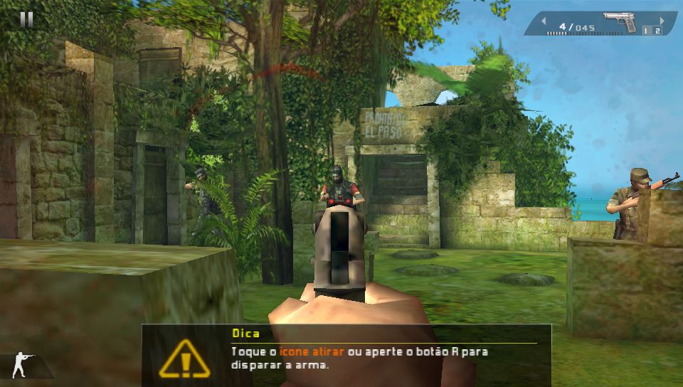
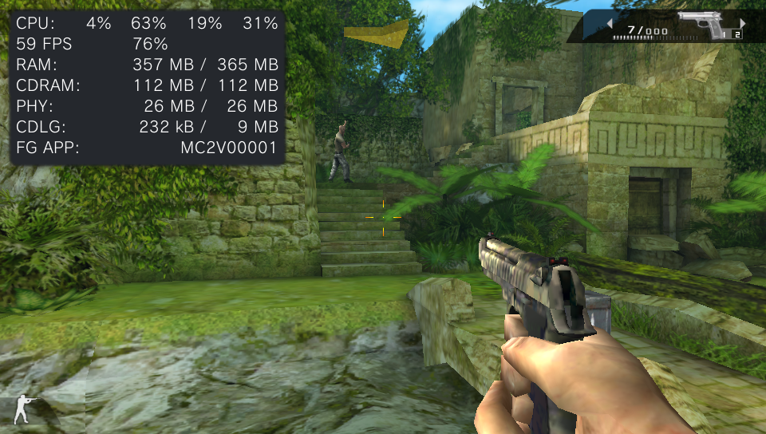

<p align="center">
  
</p>

# MC2BPegasus-Vita

Unofficial wrapper/port of **Modern Combat 2: Black Pegasus** for PlayStation Vita.

The port operates by loading the official Android ARMv7 executable directly into memory, linking its dependencies to native functions, providing the JNI environment expected by the game, and translating OpenGL ES calls through vitaGL. In practice, this creates a lightweight Android-like environment where the original executable can run natively on the PS Vita.

> Port by **MeninoSung**

## About the port

This project uses an Android shared-object loader and FalsoJNI to run the original `libsandstorm2.so` library on the PS Vita. The graphics layer is implemented with [VitaGL](https://github.com/Rinnegatamante/vitaGL), while platform-specific replacements provide input, audio, filesystem, lifecycle, and media functionality expected by the Android version.

The target game build uses the Gameloft package namespace `com.gameloft.android.GAND.GloftBPHP.ML`, the Xperia Play device profile, and game data stored under `GloftBPHP/data/`. The loader reproduces the JNI initialization sequence used by that build instead of relying on a generic `android_main` entry point.

_This port does not distribute the game's commercial data. Users must provide their own legally obtained, compatible Android copy and extract the required files themselves._

## Setup Instructions (For End Users)

In order to properly install the game, follow these steps precisely:

- Install [kubridge](https://github.com/TheOfficialFloW/kubridge/releases/) and [FdFix](https://github.com/TheOfficialFloW/FdFix/releases/) by copying `kubridge.skprx` and `fd_fix.skprx` to your taiHEN plugins folder (usually `ur0:tai`) and adding the following entries to `config.txt` under `*KERNEL`:

```text
*KERNEL
ur0:tai/kubridge.skprx
ur0:tai/fd_fix.skprx
```

**Note:** Do not install `fd_fix.skprx` if you are using the rePatch plugin.

- **Optional:** Install [PSVshell](https://github.com/Electry/PSVshell/releases/) if you want to monitor performance. Overclocking is not required: the port runs at a stable 60 FPS at the PS Vita's standard 333 MHz CPU clock.
- Install `libshacccg.suprx`, if you do not already have it, by following [this guide](https://samilops2.gitbook.io/vita-troubleshooting-guide/shader-compiler/extract-libshacccg.suprx).
- Obtain a legal copy of **Modern Combat 2: Black Pegasus version 1.0.0** for Android ARMv7.
- Do not combine `libsandstorm2.so` and data files from different releases.

### Supported Android Build

| Property | Value |
|---|---|
| Game | Modern Combat 2: Black Pegasus |
| Version | 1.0.0 |
| Architecture | ARMv7 |
| Native library | `libsandstorm2.so` |
| Package namespace | `com.gameloft.android.GAND.GloftBPHP.ML` |
| Data profile | Xperia Play / `GloftBPHP` |

_Only data extracted from version 1.0.0 is supported. Files from other versions may use incompatible native code, resources, or data layouts._

### How to Prepare the Game Files

1. Extract your legally obtained Android game package and game data for version **1.0.0**.
2. Locate `libsandstorm2.so` in the APK's ARMv7 library folder.
3. Locate the matching `GloftBPHP/data` directory.
4. Create a folder named `moderncombat2` with the following structure:

   ```text
   Moderncombat2/
   |-- libsandstorm2.so
   |-- files/
   `-- GloftBPHP/
       |-- CheckPoint.bin
       |-- SaveGame.bin
       `-- data/
           |-- Constants.bin
           |-- 2d.header
           |-- 2d.pak
           |-- 3d.header
           |-- 3d.pak
           |-- automat.header
           |-- automat.pak
           |-- structs.header
           |-- structs.pak
           |-- texts.header
           |-- texts.pak
           |-- audio/
           `-- intro/
               `-- logo.mp4
   ```

5. Keep all files from the same version 1.0.0 release together. Do not replace individual files with data from another version.

### Installation on PS Vita

1. Install `MC2BPegasus-Vita.vpk` on your PS Vita using VitaShell.
2. Copy the prepared `moderncombat2` folder to `ux0:data/`.
3. Verify that the files are located at these paths:

   ```text
   ux0:data/moderncombat2/libsandstorm2.so
   ux0:data/moderncombat2/GloftBPHP/data/
   ```

4. Launch **PegasusVita** from the LiveArea.

If startup fails, check `ux0:data/moderncombat2/port.log`. The loader also creates `ux0:data/mc2_boot.log` when the application reaches its main entry point.

### Language

The supported languages are:

- English
- French
- German
- Italian
- Spanish
- Japanese

For the best compatibility, set the game to English after the first launch:

```text
Options > Languages > English
```

## Controls

The port supports the front touchscreen, both analog sticks, and the physical PS Vita controls. The physical buttons are exposed to the game using its original Xperia Play mappings.

<div align="center">
  <table>
    <thead>
      <tr>
        <th align="center">Control</th>
        <th align="center">Action</th>
      </tr>
    </thead>
    <tbody>
      <tr><td align="center">Left analog stick</td><td align="center">Movement</td></tr>
      <tr><td align="center">Right analog stick</td><td align="center">Camera / aiming</td></tr>
      <tr><td align="center">D-pad</td><td align="center">Android D-pad directions</td></tr>
      <tr><td align="center">Cross</td><td align="center">D-pad center / confirm</td></tr>
      <tr><td align="center">Circle</td><td align="center">Back</td></tr>
      <tr><td align="center">Square</td><td align="center">Xperia Play X button</td></tr>
      <tr><td align="center">Triangle</td><td align="center">Xperia Play Y button</td></tr>
      <tr><td align="center">L / R</td><td align="center">Xperia Play L1 / R1</td></tr>
      <tr><td align="center">START / SELECT</td><td align="center">Start / Select</td></tr>
      <tr><td align="center">Front touchscreen</td><td align="center">Menus, touch controls, and on-screen interactions</td></tr>
    </tbody>
  </table>
</div>

_The exact in-game action of each Xperia Play button can vary by screen and control configuration._

## Screenshots

<p align="center">
  
  
  
  
  
</p>

The game runs at a stable **60 FPS** on standard PS Vita clocks, including the default **333 MHz CPU clock**. Overclocking is not required for normal gameplay.

## Build Instructions (For Developers)

Requirements:

- [VitaSDK](https://vitasdk.org/) configured through the `VITASDK` environment variable;
- an ARM `softfp` toolchain and compatible dependencies;
- vitaGL, vitashark, FalsoJNI, OpenSLES, and the audio libraries referenced by `CMakeLists.txt`;
- `kubridge.skprx` installed on the target Vita.

### Compile

```bash
cmake -S . -B build -DCMAKE_BUILD_TYPE=Release
cmake --build build
```

The current repository includes the distributable as `MC2BPegasus-Vita.vpk`. A local CMake build generates `Pegasus_Vita.vpk` with title ID `MC2V00001`. By default, the loader expects the game files at `ux0:data/moderncombat2/`. The path can be changed at configure time:

```bash
cmake -S . -B build \
  -DDATA_PATH="ux0:data/moderncombat2/" \
  -DGAME_SO_PATH="ux0:data/moderncombat2/libsandstorm2.so"
cmake --build build
```

Debug builds enable additional loader diagnostics:

```bash
cmake -S . -B build-debug -DCMAKE_BUILD_TYPE=Debug
cmake --build build-debug
```

## Known Issues

- Touch input still has some interaction bugs caused by conflicts with the virtual movement joystick.
- Some textures, including weapons lying on the ground, are missing.
- Files from Android releases other than version 1.0.0 are not supported.
- Network services, purchases, and integrations tied to discontinued Android or Gameloft infrastructure are not supported.

## Legal Notice

This is an unofficial, free, non-commercial port. **Modern Combat 2: Black Pegasus**, Modern Combat, Gameloft, and all related assets and trademarks belong to their respective developers and copyright holders.

This repository must not be used to distribute commercial APKs, native libraries, or game data. Use only files from a copy you obtained legally and support the original developers.

## Credits

The loader code is derived from work by Volodymyr Atamanenko and the wider PS Vita Android-porting community. FalsoJNI is distributed in `lib/falso_jni` under its own license. Rights to Modern Combat 2 and its assets belong to their respective owners.

- **Port by MeninoSung**
- TheFloW for the original Android `.so` loading research and infrastructure.
- Volodymyr Atamanenko (`v-atamanenko`) for the loader, FalsoJNI-related work, and Gameloft porting references.
- Rinnegatamante for [VitaGL](https://github.com/Rinnegatamante/vitaGL).
- VitaSDK contributors and the PS Vita homebrew community.
- Original game by Gameloft and its respective rights holders.

---

## AI Notice

Artificial intelligence tools (Codex/ChatGPT) were used to assist with code analysis, compatibility investigation, documentation, and the iterative development process.
